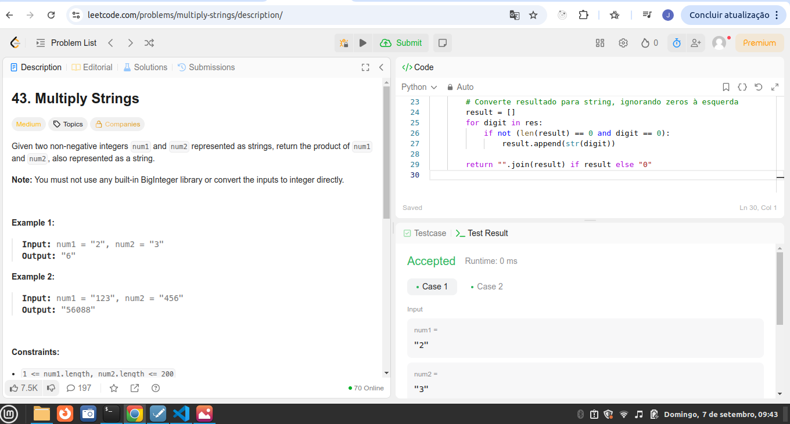
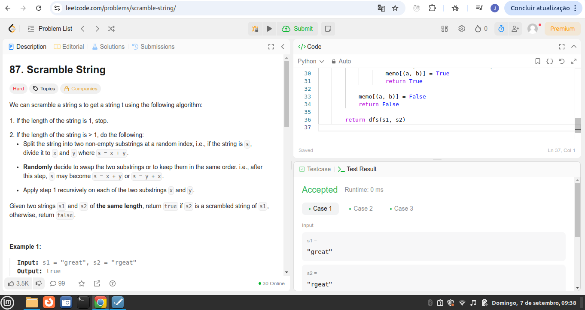

# Algorítmos de busca!

**Número da Lista**: 31<br>
**Conteúdo da Disciplina**: Algorítmos de busca!<br>

## Alunos
|Matrícula | Aluno |
| -- | -- |
| 211031074 | João Pedro da Silva Rodrigues |
| 221022696 | Nathan Benigno Ponce de Abreu |

## Sobre 

### Questões Difíceis
| Título | Responsável | 
| -- | -- | 
| 30. Substring with Concatenation of All Words | Nathan Abreu | 
| 4. Median of Two Sorted Arrays  | Nathan Abreu | 
| 43. Multiply Strings: Nível de dificuldade médio| João Pedro | 
| 87. Scramble String: Nível de dificuldade díficil | João Pedro | 


## Screenshots
### [(Mediana de 2 vetores ordenados)](https://leetcode.com/problems/median-of-two-sorted-arrays/)


### [ (Concatenação de todas as palavras com Substring)](https://leetcode.com/problems/substring-with-concatenation-of-all-words/description/)


### [(Multiplicação de 2 strings)](https://leetcode.com/problems/multiply-strings/description/)



### [(Embaralhar String)](https://leetcode.com/problems/scramble-string/description/)

 


## Link do vídeo

Adicionar URL DO YOUTUBE AQUI: https://youtu.be/xIBc8k4cfC0


## Guia de execução

### Questão 01

rode o Python: Nathan/Substring.py

```
input: 
s = "barfoothefoobarman"
words = ["foo","bar"]

output: 
[0,9]

```

### Questão 02

rode o Python: Nathan/Median.py

```
input: 
nums1 = [1,3]
num2 = [2]

output:
2.00000

```

### Questão 03

rode o Python: Joao_Pedro/multiply_String_Medium.py

```
input: 
Caso 1: num1 = "2", num2 = "3"
Case 2: num1 = "123", num2 = "456"

output:
Caso 1: "6"
Case 2: "56088"

```

### Questão 04

rode o Python: Joao_Pedro/Scramble_String_Hard.py

```
input: 
Caso 1: s1 = "abcde", s2 = "caebd"
Case 2: s1 = "a", s2 = "a"

output:
Caso 1: false
Caso 2: true

```

## Instalação 
python instalado

**Linguagem**: Python <br>
