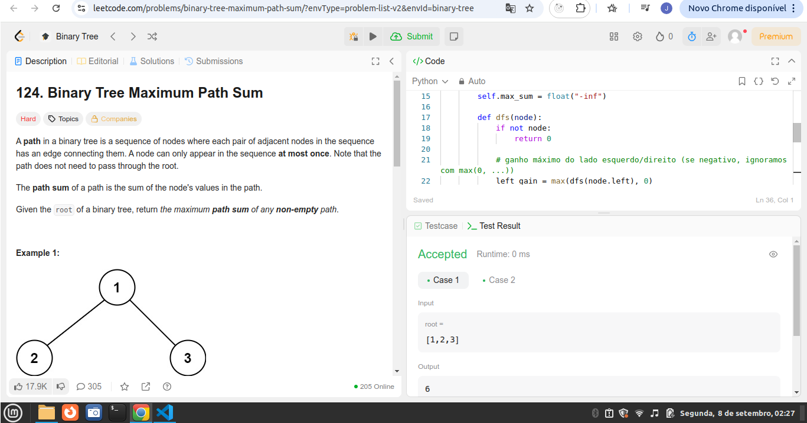
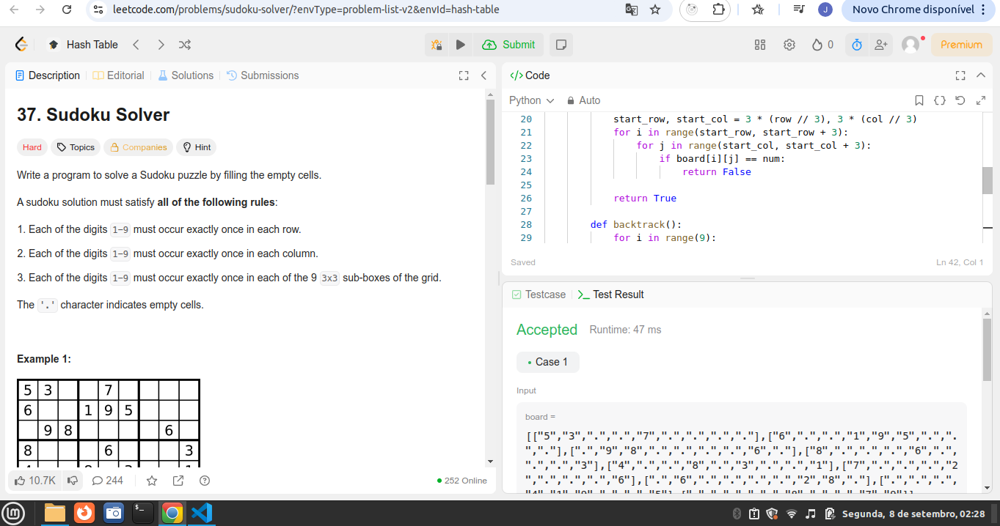

# Algorítmos de busca!

**Número da Lista**: 31<br>
**Conteúdo da Disciplina**: Algorítmos de busca!<br>

## Alunos
|Matrícula | Aluno |
| -- | -- |
| 211031074 | João Pedro da Silva Rodrigues |
| 221022696 | Nathan Benigno Ponce de Abreu |

## Sobre 

### Questões Difíceis
| Título | Responsável | 
| -- | -- | 
| 30. Substring with Concatenation of All Words | Nathan Abreu | 
| 4. Median of Two Sorted Arrays  | Nathan Abreu | 
| 43. Multiply Strings: Nível de dificuldade médio| João Pedro | 
| 87. Scramble String: Nível de dificuldade díficil | João Pedro | 


## Screenshots
### [(Mediana de 2 vetores ordenados)](https://leetcode.com/problems/median-of-two-sorted-arrays/)


### [ (Concatenação de todas as palavras com Substring)](https://leetcode.com/problems/substring-with-concatenation-of-all-words/description/)


### [(Soma máxima do caminho da árvore binária)](https://leetcode.com/problems/binary-tree-maximum-path-sum/description/?envType=problem-list-v2&envId=binary-tree)



### [(Solucionador de Sudoku)](https://leetcode.com/problems/sudoku-solver/description/?envType=problem-list-v2&envId=hash-table)

 


## Link do vídeo

https://youtu.be/v1Hp2W2oak0

## Guia de execução

### Questão 01

rode o Python: Nathan/Substring.py

```
input: 
s = "barfoothefoobarman"
words = ["foo","bar"]

output: 
[0,9]

```

### Questão 02

rode o Python: Nathan/Median.py

```
input: 
nums1 = [1,3]
num2 = [2]

output:
2.00000

```

### Questão 03

rode o Python: Joao_Pedro/BinaryTree.py

```
input: 
root = [1,2,3]


output:
 6

```

### Questão 04

rode o Python: Joao_Pedro/SudokuSolver.py

```
input: 
board = [["5","3",".",".","7",".",".",".","."],["6",".",".","1","9","5",".",".","."],[".","9","8",".",".",".",".","6","."],["8",".",".",".","6",".",".",".","3"],["4",".",".","8",".","3",".",".","1"],["7",".",".",".","2",".",".",".","6"],[".","6",".",".",".",".","2","8","."],[".",".",".","4","1","9",".",".","5"],[".",".",".",".","8",".",".","7","9"]]

output:
[["5","3","4","6","7","8","9","1","2"],["6","7","2","1","9","5","3","4","8"],["1","9","8","3","4","2","5","6","7"],["8","5","9","7","6","1","4","2","3"],["4","2","6","8","5","3","7","9","1"],["7","1","3","9","2","4","8","5","6"],["9","6","1","5","3","7","2","8","4"],["2","8","7","4","1","9","6","3","5"],["3","4","5","2","8","6","1","7","9"]]

```

## Instalação 
python instalado

**Linguagem**: Python <br>
